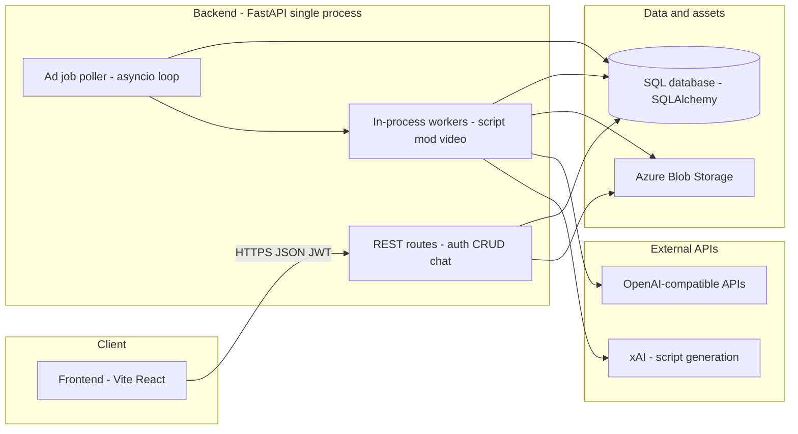

# Architecture (high level)

This document answers: **“How is this system put together?”** It reflects the **code in this repository** today. The [root README](../README.md) also describes a **broader multi-service vision** (Node gateways, Celery, separate analytics, etc.); those pieces are not all present as separate deployables in this repo yet—see [README vs this repo](#readme-vs-this-repo) below.

---

## What the system does overall

**Adgentic AI** helps business users **create, manage, and iterate on social-style video ads**: campaigns and products are stored in a database, **consumer personas** and traits drive targeting, and a pipeline **generates scripts, moderates them, renders short video**, and **stores assets** for the UI to show. Auth is JWT-based; the dashboard talks to one HTTP API.

---

## Major components and how they interact

- **`frontend/`** — SPA (Vite + React). Calls the FastAPI backend for auth, resources, and chat-style features.
- **`backend/`** — One **FastAPI** application (`main.py`) that exposes:
  - **Resource APIs** under paths like `/auth`, `/campaigns`, `/ad-jobs`, `/consumers`, `/personas`, `/products`, `/chat/...`, etc.
  - **Worker HTTP routes** under `/ad-job-worker` and `/ad-post-worker`: includes **hello-style** endpoints and **generation triggers** (e.g. **`POST /ad-job-worker/run-ad-job`** runs the full pipeline **in-process**, not a separate worker service). Heavy work is still **not** isolated in another deployable here.
- **In-process orchestration** — On startup, the app starts an **asyncio background poller** (`services/ad_job_poller`) that watches the database for **pending ad jobs**, claims them, and runs **`execute_ad_job`** in `workers/ad_job_worker` (script → moderation → video → blob upload).

There is **no separate message broker** (e.g. Redis/RabbitMQ) in the current dependency set: **the SQL `ad_jobs` table is the queue**, with **row-level locking** (`locked_at` / `locked_by`) so multiple API instances can poll safely.

---

## Major data flows

### 1. Interactive dashboard and CRUD

Browser → **FastAPI routes** (`routes/*`) → **SQLAlchemy** sessions (`get_db`) → **CRUD** + **Pydantic schemas** → JSON responses. Routes that use **`get_current_client_id`** validate **`JWT_SECRET`**-signed bearer tokens (`dependencies.py`). **Not every resource route is JWT-scoped today** (e.g. parts of **`/campaigns`**); see [BACKEND.md](./BACKEND.md).

### 2. Product images

Uploads flow through **`routes/product.py`**: files land in Azure Blob (**`product-images`** container). Ad generation later **downloads** the same blob by `image_name` when building a variant.

### 3. Persona / consumer enrichment

Operations such as persona assignment use **`get_openai_client()`** and **`services/consumer_persona_processor`** / **`services/persona_assignment`** — LLM calls over **OpenAI’s client**, backed by **`OPENAI_API_KEY`** (see `core/openai_client.py` and consumers route).

### 4. Ad generation pipeline (async, DB-driven)

1. Something (e.g. campaign flow) creates **`ad_job` rows** and an **`ad_job_batch`** with JSON **`input_json`** (campaign / product / consumer / version).
2. The **poller** picks pending jobs, **claims** one atomically, and runs **`execute_ad_job`**:
   - Creates / updates **`ad_variant`** rows (status, `meta`, `media_url`).
   - Loads campaign, consumer traits, product; **downloads product image** from Blob.
   - **`generate_ad_script`** — uses **xAI SDK** (`xai_sdk`) and env such as **`SCRIPT_*`** (see `workers/script_creation_worker`).
   - **`evaluate_script`** — moderation pass via an **OpenAI-compatible** client (`workers/script_moderation_worker`).
   - **`generate_ad_video`** — **OpenAI video API** (`AsyncOpenAI` + **`VIDEO_API_KEY`**), polls until complete.
   - Uploads MP4 to **`ad-videos`** container; stores URL on the variant.

Failures are recorded on the variant **`meta`** (e.g. error trace) and statuses move to **`failed`** where applicable.

---

## Key services, storage, and integrations

| Kind | Implementation in repo |
|------|-------------------------|
| **HTTP API** | FastAPI `main.py`, routers under `backend/routes/`, workers’ `service.py` routers |
| **Background jobs** | `services/ad_job_poller/service.py` + `workers/ad_job_worker/` (no Celery worker process in tree) |
| **Database** | SQLAlchemy; URL from **`DB_CONNECTION_STRING`** / **`DB_PASSWORD`**, or **Azure AD** path via **`USE_AZURE_AD`** + **`DB_ODBC_CONNECTION_STRING`** (`database.py`) |
| **Blob storage** | **Azure Storage** — **`AZURE_STORAGE_CONNECTION_STRING`**; containers e.g. **`product-images`**, **`ad-videos`** |
| **Caches** | None required for core flow; clients may be cached in-process (e.g. OpenAI client LRU) |
| **Queues** | **Database** (`ad_jobs` + locks), not a separate queue service |
| **LLM / media APIs** | **OpenAI** (chat, video, some moderation paths), **xAI** (script generation SDK), env-driven keys/URLs (`backend/.env.example`) |

---

## Deployment shape (high level)

- **API** — [Render](https://render.com) **Docker web service** defined in [`render.yaml`](../render.yaml): build context is **`backend/`**, typical branch **`main`**.
- **Local / team** — [`docker-compose.yml`](../docker-compose.yml) and [`Makefile`](../Makefile) describe bringing up backend/frontend together; exact container layout may drift from local `npm run dev` + `python main.py`.
- **Frontend** — Built as a **Vite** app (`frontend/`); CI runs **`npm run build`**. Production hosting for the static/SSR asset is not fully described in `render.yaml` in this snippet—confirm with team docs or infra.

---

## Important constraints and invariants

1. **`ALLOWED_ORIGINS`** must be set at process start (CORS middleware reads it eagerly).
2. **`JWT_SECRET`** must be set for any JWT issuance or verification path.
3. **Ad jobs** rely on **atomic claims** in the DB; do not remove locking without a replacement concurrency story.
4. **One poller task per process** is started in **`main.py` lifespan**; horizontal scaling adds more processes, each with its own poller—safe **if** DB claiming stays atomic.
5. **Script → video** coupling: the script format is **contractual** for the video generator (structured beats/time ranges); changing prompts or format requires **end-to-end** checks.
6. **Azure** is assumed for **blob** paths used in production flows; local/dev may mock or skip some integrations (tests use SQLite and env stubs per CI).

---

## README vs this repo

The [root README](../README.md) lists **Node API gateways**, **Celery**, **multiple Python services**, **Next.js** frontends, etc. In **this repository as checked in**, the main application surface is:

- **Python FastAPI** backend (single service entrypoint),
- **Vite + React** frontend,

with **DB-backed job processing** instead of a visible Celery deployment in code. Treat the README as **product + target architecture**; treat this file + `backend/main.py` as **what runs today**.

---

## Links to deeper docs

| Document | Use |
|----------|-----|
| [AGENTS.md](../AGENTS.md) | How to run, test, lint, directory map, safety |
| [PRODUCT.md](./PRODUCT.md) | Product behavior and business rules |
| [BACKEND.md](./BACKEND.md) | Backend layers, auth, jobs, API conventions |
| [FRONTEND.md](./FRONTEND.md) | Frontend structure and house style |
| [TESTING.md](./TESTING.md) | How to validate changes |
| [references/](./references/) | Lookup: API paths, env vars, routes, tables, CI |
| [design-docs/](./design-docs/) | Design write-ups for major changes (before implementation) |
| [README.md](../README.md) | Product narrative, diagram, setup, Docker/Make |
| [backend/README.md](../backend/README.md) | Backend ports, worker route prefixes, local run |
| [CLAUDE.md](../CLAUDE.md) | Review workflow for large or risky changes |
| [backend/main.py](../backend/main.py) | Authoritative router list and lifespan (poller) |
| [backend/.env.example](../backend/.env.example) | Required env vars for integrations |

Further notes live under [`agent_resources/`](./) (this folder).
